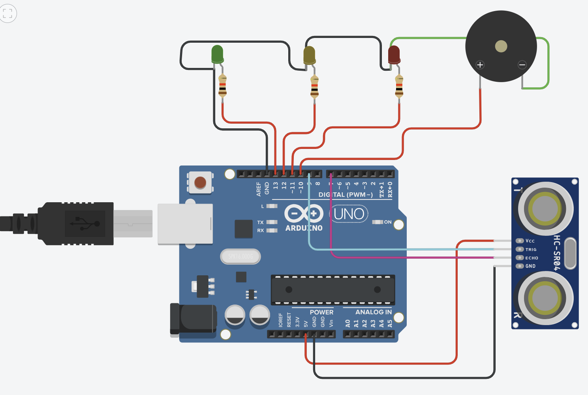
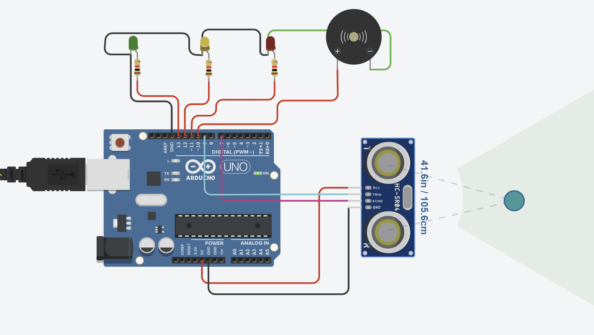

# Smart Parking Assistant

An Arduino-based Smart Parking Assistant that uses an ultrasonic sensor, LEDs, and a buzzer to help drivers judge parking distance safely.

## Features

- Measures distance using an HC-SR04 ultrasonic sensor
- Green LED indicates a safe distance
- Yellow LED indicates caution
- Red LED indicates stop
- Buzzer provides audio warnings
- Real-time distance monitoring through the Serial Monitor

## Components Used

- Arduino Uno
- HC-SR04 Ultrasonic Sensor
- Green LED
- Yellow LED
- Red LED
- Piezo Buzzer
- Breadboard
- Jumper Wires
- Resistors

## Pin Connections

| Component | Arduino Pin |
|------------|------------|
| Green LED | 13 |
| Yellow LED | 12 |
| Red LED | 11 |
| Buzzer | 10 |
| Trig Pin | 9 |
| Echo Pin | 7 |

## How It Works

The ultrasonic sensor continuously measures the distance between the vehicle and an obstacle.

- Distance greater than 30 cm → Green LED ON
- Distance between 10 cm and 30 cm → Yellow LED ON and buzzer beeps
- Distance less than 10 cm → Red LED ON and buzzer sounds continuously

## Project Images

### Circuit Diagram

### Simulation

## Skills Demonstrated

- Arduino Programming
- Embedded Systems
- Sensor Integration
- Circuit Design
- Distance Measurement
- Troubleshooting
- Robotics Fundamentals

## Future Improvements

- Add an LCD display for distance readings
- Add multiple sensors for wider coverage
- Integrate Bluetooth monitoring
- Develop a mobile app interface

## Author

Shamira Robinson

Computer Engineering Student | Future Robotics Engineer
